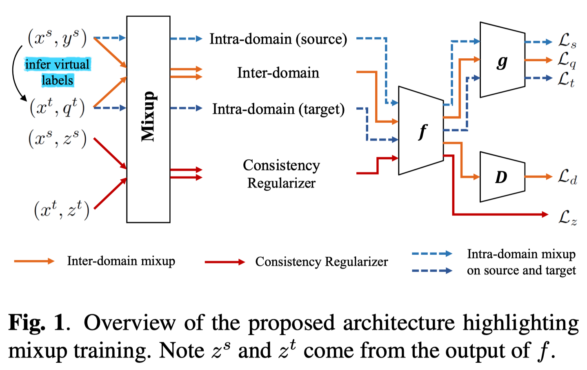

## Improve Unsupervised Domain Adaptation with Mixup Training

Proposed method: The inter- and intra-domain mixup training constitute the proposed **IIMT** framework for enforcing multifaceted constraints to improve target domain performance.

核心思想还是线性归纳偏置, 由域内/域间/特征层面的Mixup达成

域间的loss为
$$
\begin{array}{r}
x_{i}^{s t}=\lambda^{\prime} x_{i}^{s}+\left(1-\lambda^{\prime}\right) x_{i}^{t} \\
q_{i}^{s t}=\lambda^{\prime} y_{i}^{s}+\left(1-\lambda^{\prime}\right) q_{i}^{t} \\
\mathcal{L}_{q}=\frac{1}{B} \sum_{i} H\left(q_{i}^{s t}, h_{\theta}\left(x_{i}^{s t}\right)\right)
\end{array}
$$
特征层面的loss为
$$
\begin{gathered}
z_{i}^{s t}=\lambda^{\prime} f_{\theta}\left(x_{i}^{s}\right)+\left(1-\lambda^{\prime}\right) f_{\theta}\left(x_{i}^{t}\right) \\
\mathcal{L}_{z}=\frac{1}{B} \sum_{i}\left\|z_{i}^{s t}-f_{\theta}\left(x_{i}^{s t}\right)\right\|_{2}^{2}
\end{gathered}
$$
还使用了DANN中的adversarial loss
$$
\mathcal{L}_{d}=\frac{1}{B} \sum_{i} \ln D\left(f_{\theta}\left(x_{i}^{s t}\right)\right)+\ln \left(1-D\left(f_{\theta}\left(x_{i}^{s t}\right)\right)\right)
$$
其中$D$为域判别器

除此之外, 还有intra-domain的mixup

反正能加mixup的地方都加上了…

