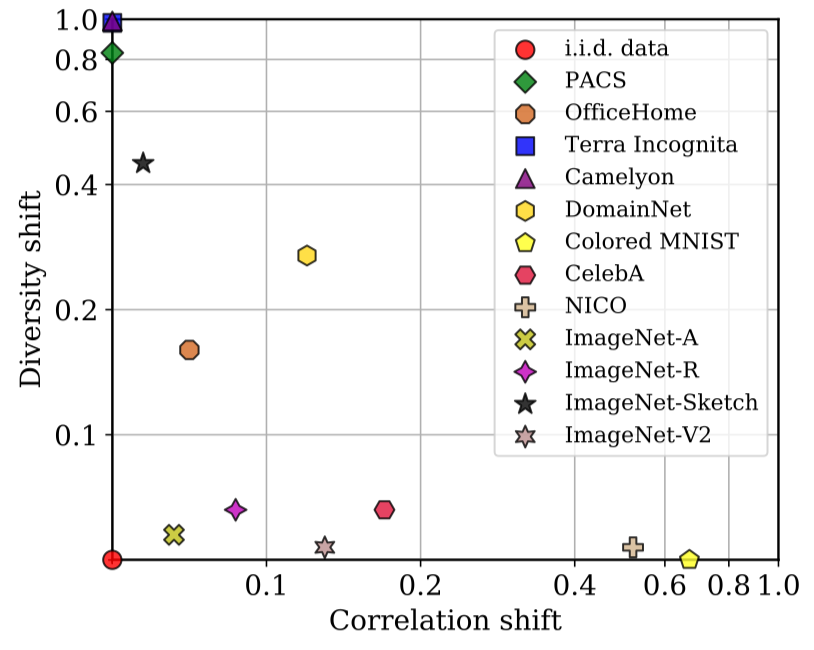
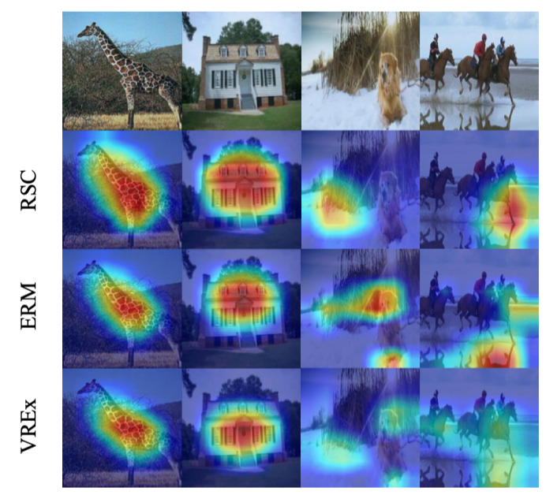

## OoD-Bench: Benchmarking and Understanding Out-of-Distribution Generalization Datasets and Algorithms

分类: 数据集, 度量

关注对数据的理解

DomainBed上的结果表明, 各种OoD算法的平均性能均与ERM相当, 算法往往在某些数据集上表现较好, 在其他数据集上表现较差, 作者猜想存在**diversity shift/correlation shift**这两种因素.

下面来定义diversity/correlation shift
$$
\mathcal{S}=\left\{\mathbf{z}_{2} \in \mathcal{Z}_{2} \mid p\left(\mathbf{z}_{2}\right) q\left(\mathbf{z}_{2}\right)=0\right\} \quad \text { and } \quad \mathcal{T}=\left\{\mathbf{z}_{2} \in \mathcal{Z}_{2} \mid p\left(\mathbf{z}_{2}\right) q\left(\mathbf{z}_{2}\right) \neq 0\right\}
$$
其中$\mathcal{Z}_2$满足$p_{Z_{2}}\left(\mathbf{z}_{2}\right) \cdot q_{Z_{2}}\left(\mathbf{z}_{2}\right)=0 \vee \exists \mathbf{y} \in \mathcal{Y}: p_{Y \mid Z_{2}}\left(\mathbf{y} \mid \mathbf{z}_{2}\right) \neq q_{Y \mid Z_{2}}\left(\mathbf{y} \mid \mathbf{z}_{2}\right)$

which then defines diversity and correlation shift:
$$
\begin{aligned}
d_{\mathrm{div}}(p, q) &=\frac{1}{2} \int_{\mathcal{S}}\left|p\left(\mathbf{z}_{2}\right)-q\left(\mathbf{z}_{2}\right)\right| d^{n} \mathbf{z}_{2} \\
d_{\operatorname{cor}}(p, q) &=\frac{1}{2} \int_{\mathcal{T}} \sqrt{p\left(\mathbf{z}_{2}\right) q\left(\mathbf{z}_{2}\right)} \sum_{\mathbf{y} \in \mathcal{Y}}\left|p\left(\mathbf{y} \mid \mathbf{z}_{2}\right)-q\left(\mathbf{y} \mid \mathbf{z}_{2}\right)\right| d^{n} \mathbf{z}_{2},
\end{aligned}
$$
其取值均在$[0,1]$.

两种shift可由下图形象化表示

作者学了一个分类器来区分环境以获得$\mathcal{Z_2}$​, 并施加==Kernel Density Estimation (KDE)==以获得diversity数值

测量结果如下图所示

对correlation shift占主导的数据不应使用训练集作为模型选择依据

实验表明RSC在diversity shift主导的数据集上表现最好, VREx在correlation shift主导的数据集上表现最好, 而没有算法恒优于ERM

作者而后针对VREx和RSC进行了经验性的分析, 绘制了其关注的焦点 (attention heatmap), 如下图所示

作者给出的几点建议

+ 算法应在diversity shift/correlation shift这两类数据集上测试, shift的程度可由文中所给方法测量

+ 针对实际问题的OoD类型设计适当的算法

+ 需设计能够捕捉真实环境中OoD信息的数据集

