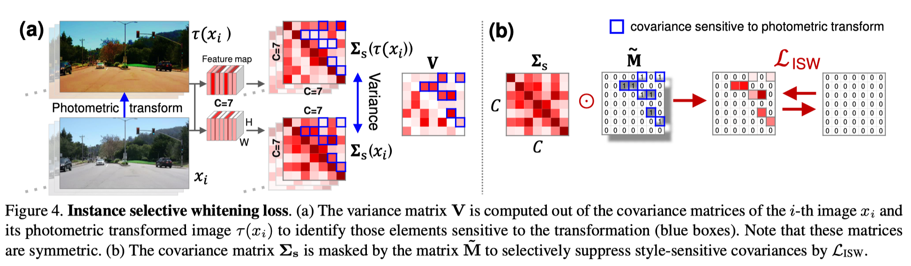
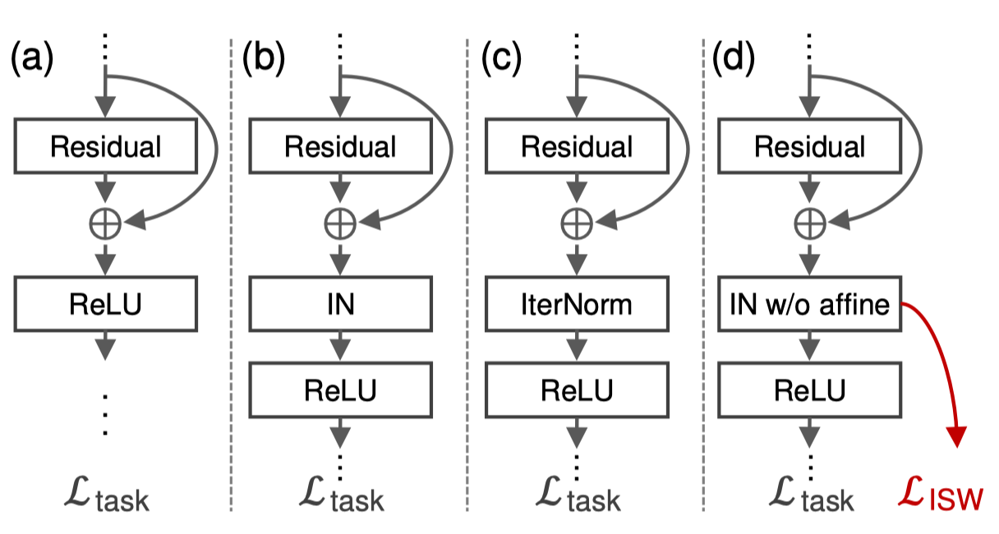
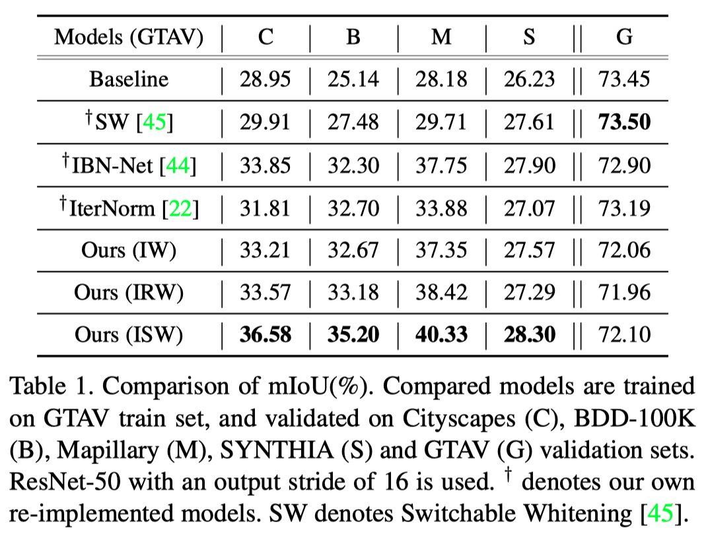
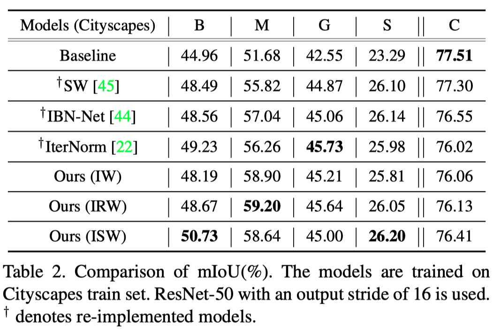

## RobustNet: Improving Domain Generalization in Urban-Scene Segmentation via Instance Selective Whitening

贡献

+ proposes a novel instance selective whitening loss to improve the robustness of the **segmentation ** networks for unseen domains
+ The proposed loss can easily be used in existing models and significantly improves the generalization ability with negligible computational cost.

思路是feature covariance contains domain-specific style such as texture and color, 故可用whitening去除, 但难点在于whitening同时会消除部分invariant特征, 故需将两种因素解耦.

Whitening: A whitening transformation is a technique that removes feature correlation and makes each feature have unit variance.

==BN improves discriminative ability on features, while IN prevents overfitting on training data==

WT的缺点包括特征值分解开销较高, deep whitening transformation (DWT) 方法使用如下loss近似进行WT
$$
\mathcal{L}_{\mathrm{DWT}}=\mathbb{E}\left[\left\|\boldsymbol{\Sigma}_{\mu}-\mathbf{I}\right\|_{1}\right]
$$
而后先讨论了如何优化WT, 再讨论如何将domain-specific style and domain-invariant content这两种因素解耦

其方法是用到了数据增广的矩方法: 只考虑颜色和模糊程度的变化, 使用color jittering和Gaussian blurring进行数据增广, 加入instance standardization layer, 对方差矩阵进行k-means聚类, 惩罚具有较大方差的特征
$$
\tilde{\mathbf{M}}_{i, j}= \begin{cases}1, & \text { if } \mathbf{V}_{i, j} \in G_{h i g h} \\ 0, & \text { otherwise }\end{cases}
$$
The ISW loss is defined as
$$
\mathcal{L}_{\mathrm{ISW}}=\mathbb{E}\left[\left\|\boldsymbol{\Sigma}_{\mathbf{s}} \odot \tilde{\mathbf{M}}\right\|_{1}\right]
$$

使用的网络结构如(d)所示

最终loss为
$$
\mathcal{L}_{\text {total }}=\mathcal{L}_{\text {task }}+\lambda\left(\frac{1}{L} \sum_{i}^{L} \mathcal{L}_{\mathrm{ISW}}^{i}\right)
$$
实验所用任务均为图像分割: Real World (Cityscapes, BDD-100K, Mapillary), Synthetic (GTAV, SYNTHIA)

相比baseline有较大提升

