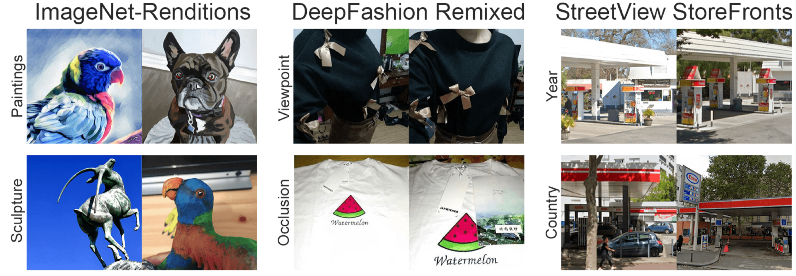
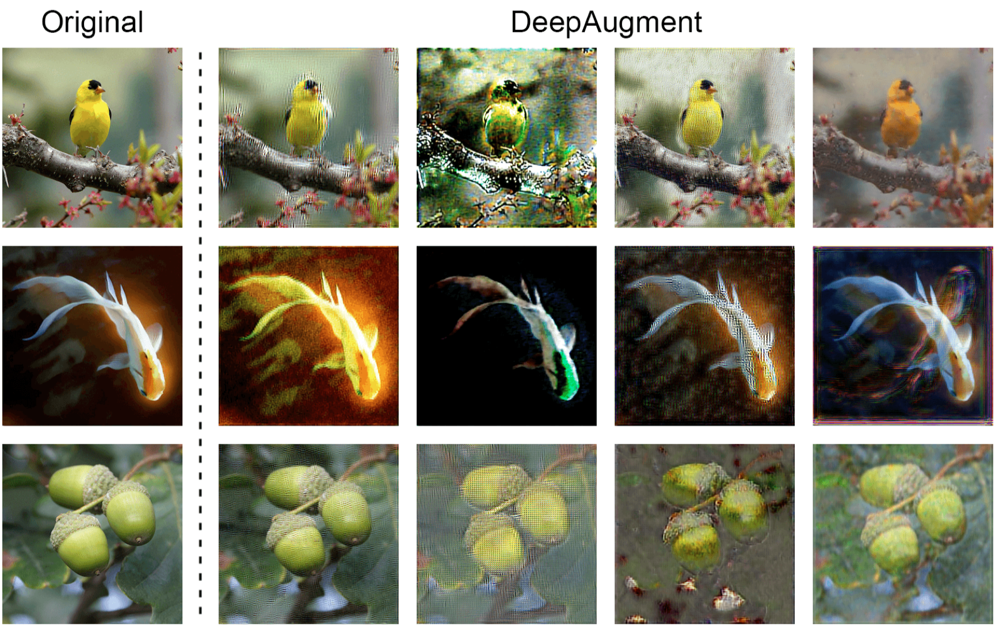
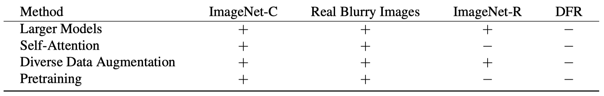

## The Many Faces of Robustness: A Critical Analysis of Out-of-Distribution Generalization

We introduce four new real-world distribution shift datasets consisting of changes in **image style, image blurriness, geographic location, camera operation**, and more.

贡献:

+ larger models and artificial data augmentations can improve robustness on realworld distribution shifts
+ improvements in artificial robustness benchmarks can transfer to real-world distribution shifts
+ 给出了一种新的数据增广方法 DeepAugment (在自编码器网络中进行随机扰动)

###### 实验

作者对四种常见方法与四种语义层面OoD数据集进行了测试

方法包括:

• Larger Models: increasing model size improves robustness to distribution shift.

• Self-Attention: adding self-attention layers to models improves robustness.

• Diverse Data Augmentation: robustness can increase through data augmentation.

• Pretraining: pretraining on larger and more diverse datasets improves robustness.

数据集包括:

+ ImageNet-Renditions (ImageNet-R), a 30,000 image test set containing various renditions (e.g., paintings, embroidery, etc.) of ImageNet object classes. These renditions are naturally occurring, with textures and local image statistics unlike those of ImageNet images, allowing us to compare against gains on synthetic robustness benchmarks.

+ StreetView StoreFronts (SVSF) and DeepFashion Remixed (DFR): 照片拍摄过程中的差异, 无材质上的改变

+ Real Blurry Images, which consists of 1,000 blurry natural images from a 100-class subset of the ImageNet classes.

###### DeepAugment

DeepAugment works by passing a clean image through an image-to-image network and introducing several perturbations during the forward pass. These perturbations are randomly sampled from a set of manually designed functions and applied to the network weights and to the feedforward signal at random layers. For example, our set of perturbations includes zeroing, negating, convolving, transposing, applying activation functions, and more. This setup above, distorts the weights and feedforward passes of imageto-image models to generate image augmentations. Speckle Noise data augmentation muliplies each pixel by (1 + x) with x sampled from a normal distribution [31, 15]. We also consider adversarial training as a form of adaptive data augmentation and use the model from [38] trained against ∞ perturbations of size ε = 4/255.

其效果如下图所示

###### 实验结果

某种意义上与OoD-bench一致, 没有恒优于ERM的算法

