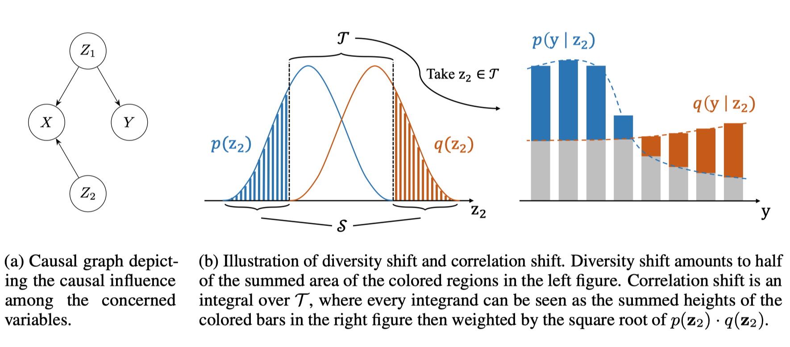

**OoD-Bench: Benchmarking and Understanding Out-of-Distribution Generalization Datasets and Algorithms**

关注对数据的理解

most of the advanced learning algorithms tailor-made for OoD generalization are still on par with the classic Empirical Risk Minimization (ERM)

We hypothesize that the phenomenon is due to the influence of two distinct kinds of distribution shift, namely **diversity shift** and **correlation shift**, while preexisting literature often focuses on merely one of them.

作者给出的几点建议

+ 算法应在diversity shift/correlation shift这两类数据集上测试, shift的程度可由文中所给方法测量

+ 针对实际问题的OoD类型设计适当的算法

+ 设计能够捕捉真实环境中OoD的数据集

下面来定义diversity/correlation shift
$$
\mathcal{S}=\left\{\mathbf{z}_{2} \in \mathcal{Z}_{2} \mid p\left(\mathbf{z}_{2}\right) q\left(\mathbf{z}_{2}\right)=0\right\} \quad \text { and } \quad \mathcal{T}=\left\{\mathbf{z}_{2} \in \mathcal{Z}_{2} \mid p\left(\mathbf{z}_{2}\right) q\left(\mathbf{z}_{2}\right) \neq 0\right\}
$$
其中$\mathcal{Z}_2$满足$p_{Z_{2}}\left(\mathbf{z}_{2}\right) \cdot q_{Z_{2}}\left(\mathbf{z}_{2}\right)=0 \vee \exists \mathbf{y} \in \mathcal{Y}: p_{Y \mid Z_{2}}\left(\mathbf{y} \mid \mathbf{z}_{2}\right) \neq q_{Y \mid Z_{2}}\left(\mathbf{y} \mid \mathbf{z}_{2}\right)$

which then defines diversity and correlation shift:
$$
\begin{aligned}
d_{\mathrm{div}}(p, q) &=\frac{1}{2} \int_{\mathcal{S}}\left|p\left(\mathbf{z}_{2}\right)-q\left(\mathbf{z}_{2}\right)\right| d^{n} \mathbf{z}_{2} \\
d_{\operatorname{cor}}(p, q) &=\frac{1}{2} \int_{\mathcal{T}} \sqrt{p\left(\mathbf{z}_{2}\right) q\left(\mathbf{z}_{2}\right)} \sum_{\mathbf{y} \in \mathcal{Y}}\left|p\left(\mathbf{y} \mid \mathbf{z}_{2}\right)-q\left(\mathbf{y} \mid \mathbf{z}_{2}\right)\right| d^{n} \mathbf{z}_{2},
\end{aligned}
$$
其取值均在$[0,1]$.

其可以由下图形象化表示

